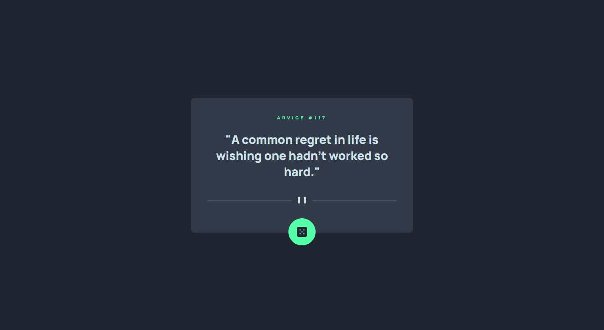

# Frontend Mentor - Advice generator app solution

This is a solution to the [Advice generator app challenge on Frontend Mentor](https://www.frontendmentor.io/challenges/advice-generator-app-QdUG-13db). Frontend Mentor challenges help you improve your coding skills by building realistic projects.

## Table of contents

- [Overview](#overview)
  - [The challenge](#the-challenge)
  - [Screenshot](#screenshot)
  - [Links](#links)
- [My process](#my-process)
  - [Built with](#built-with)
  - [What I learned](#what-i-learned)
  - [Continued development](#continued-development)
- [Author](#author)

## Overview

### The challenge

Users should be able to:

- View the optimal layout for the app depending on their device's screen size
- See hover states for all interactive elements on the page
- Generate a new piece of advice by clicking the dice icon

### Screenshot



### Links

- Solution URL: [https://www.frontendmentor.io/solutions/advice-generator-app-JVUtLYzcL0](https://www.frontendmentor.io/solutions/advice-generator-app-JVUtLYzcL0)
- Live Site URL: [https://wat-advice-generator.vercel.app/](https://wat-advice-generator.vercel.app/)

## My process

### Built with

- Semantic HTML5 markup
- CSS custom properties
- Flexbox
- Mobile-first workflow
- Responsive design
- [Advice Slip API](https://api.adviceslip.com) - Api

### What I learned

This project helped me improve my Javascript skills, especially using APIs.

See a part of the code where I made the request to the API:

```js
async function getAdvice() {
  showLoadingMessage();
  avoidSpam();

  const url = "https://api.adviceslip.com/advice";
  const response = await fetch(url);
  const adviceSlip = await response.json();

  showAdvice(adviceSlip.slip);
}
```

### Continued development

I will continue to focus on improving my skills as a programmer, practicing more and more with projects like this one.

## Author

- My Projects - [GitHub](https://github.com/wallacycaike?tab=repositories)
- Frontend Mentor - [@wallacycaike](https://www.frontendmentor.io/profile/wallacycaike)
